**##CREACION DEL MODELO CAR**

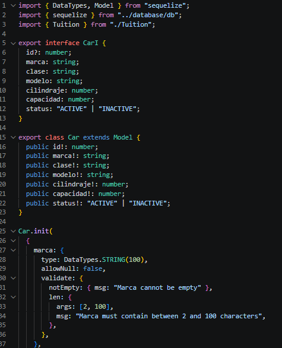

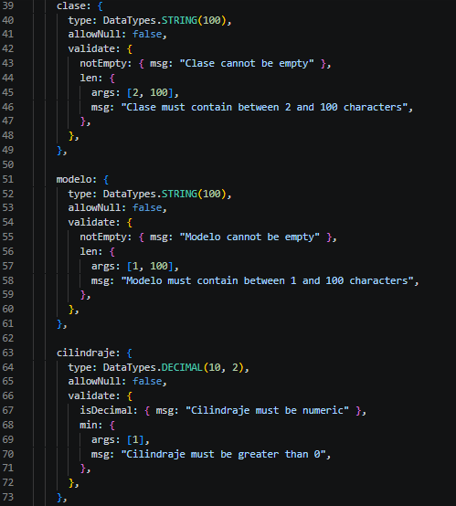

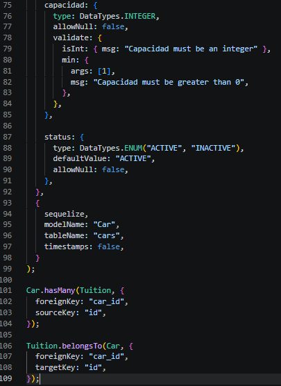

**##CREACION DEL MODELO TUITION**

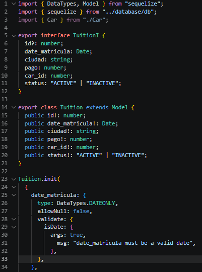

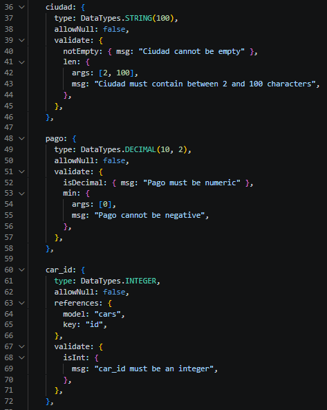

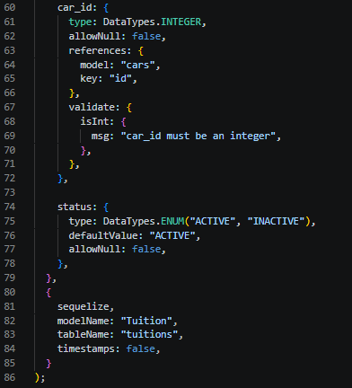

**PROMPT PARA LA IA PARA LA TRANSFORMACION DE MIS TABLAS SQL EN MODELOS DONDE LE INDIQUÉ LOS REQUISITOS QUE DEBE TENER Y CON UN EJEMPLO DE COMO DEBE SER LA ESTRUCTURA DE ESTOS**

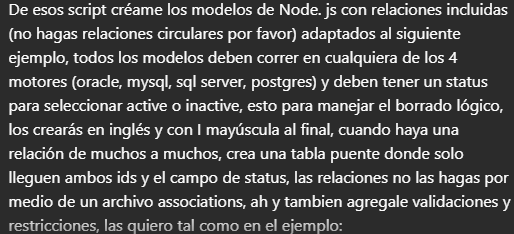

**##CREACION DE LA BASE DE DATOS DESDE UBUNTU CON SUS TABLAS Y MUESTRA FISICA DESDE DBEAVER**

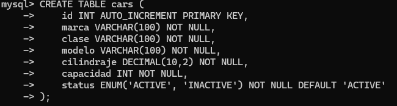

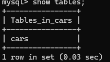

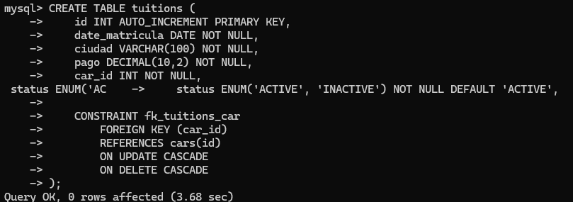

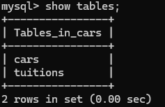

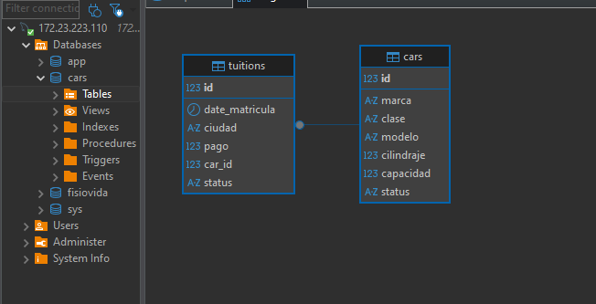

**##CREACION DEL CONTROLADOR CARS**

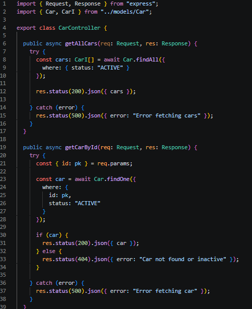

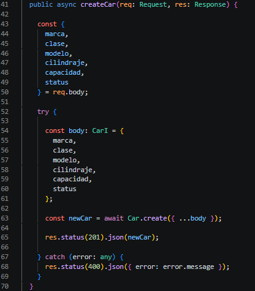

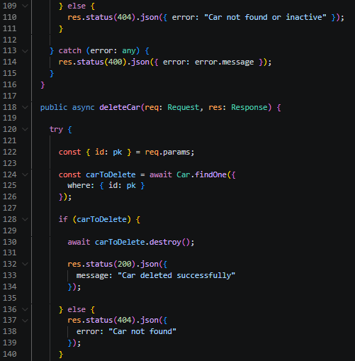

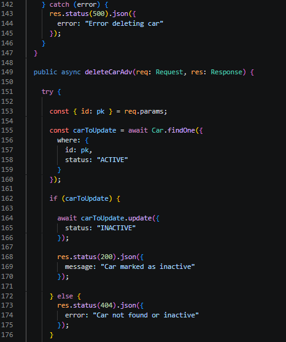

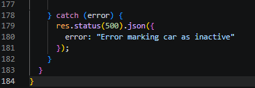

**##CREACION DEL CONTROLADOR CARS**

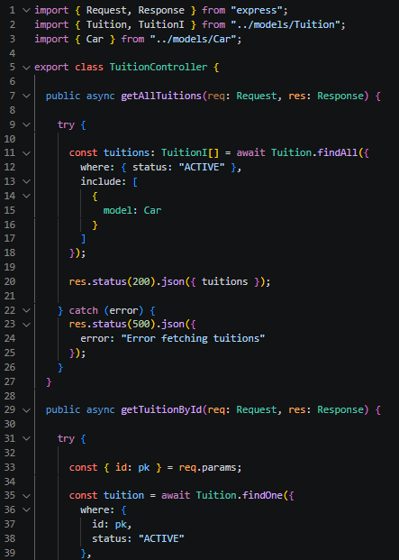

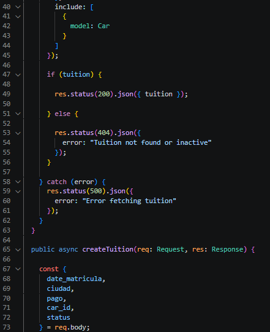

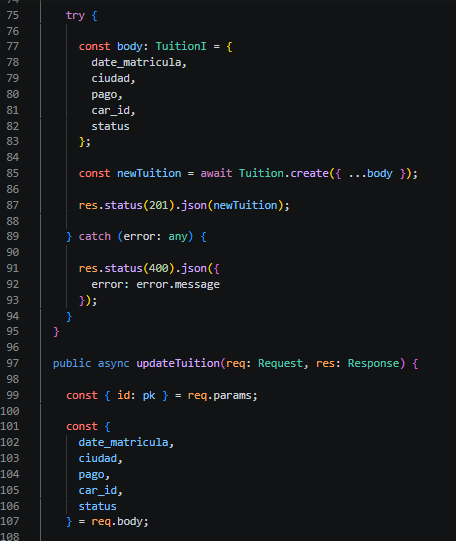

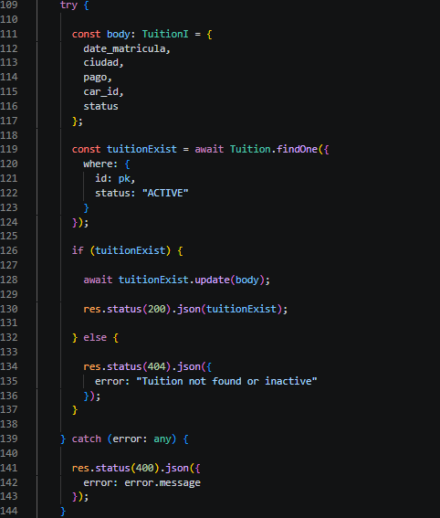

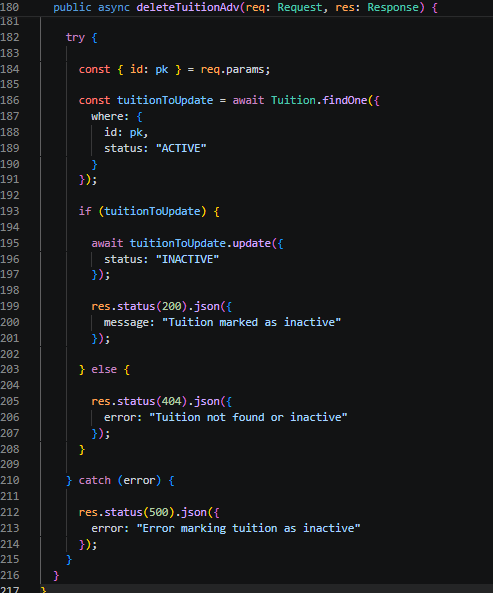

**##CREACION DE LA RUTA CARS**

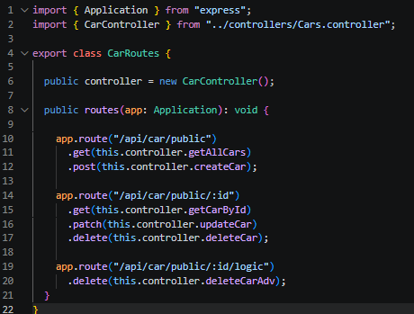

**##CREACION DE LA RUTA TUITION**

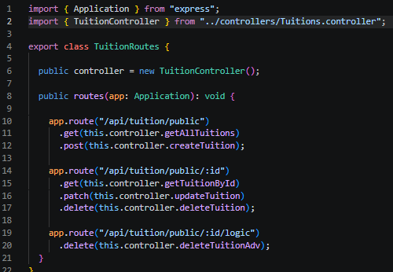